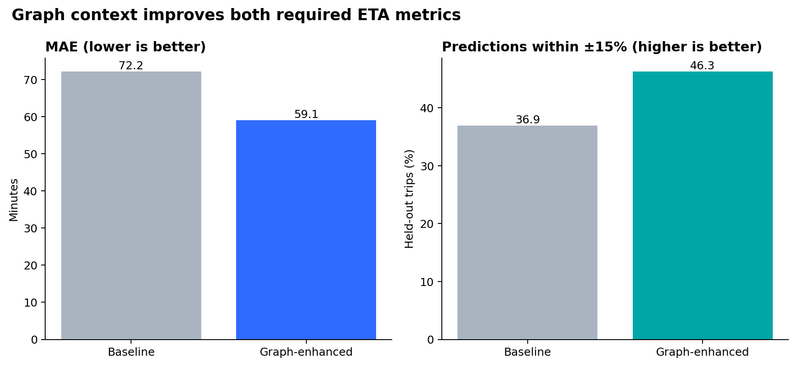
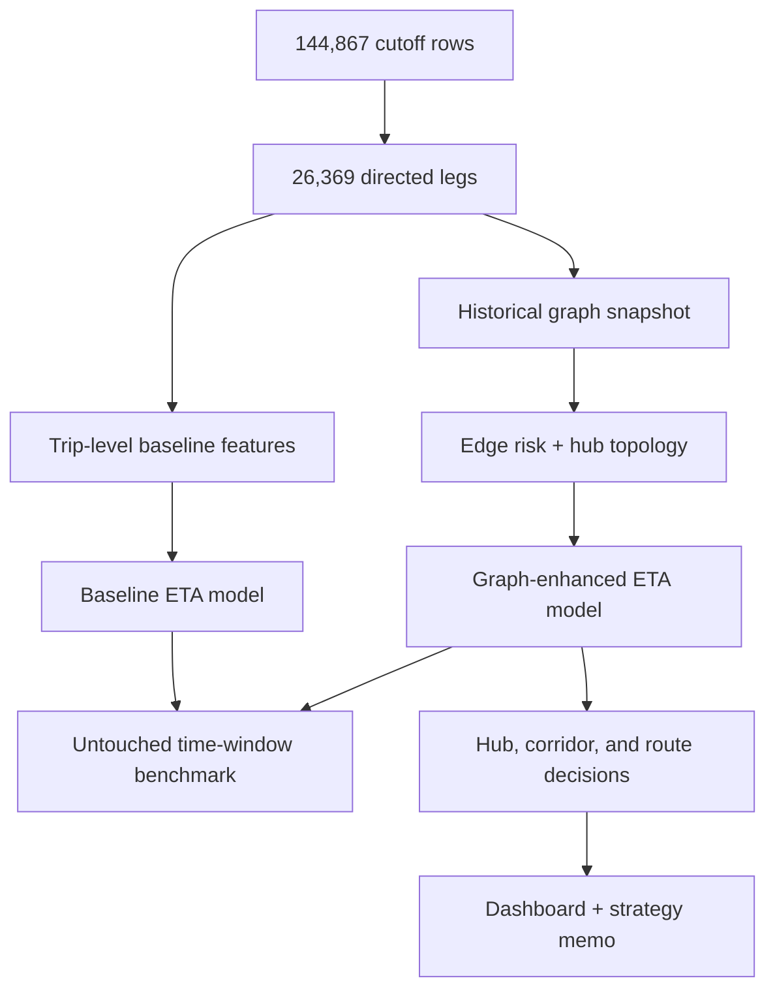

# Optimizing Delivery ETAs with Graph-Based Network Intelligence

A reproducible machine-learning and network-science system for Delhivery operations. It converts 144,867 raw cutoff rows into a directed facility graph, benchmarks a leakage-aware ETA model, ranks hubs and corridors by SLA exposure, compares FTL with Carting, and translates the results into an operations memo and dashboard.

## Result

The graph-enhanced model wins on both required held-out metrics:

| Metric (2,964 later trips) | Baseline | Graph-enhanced | Improvement |
|---|---:|---:|---:|
| MAE | 72.2 min | **59.1 min** | **18.2% lower** |
| ETA within ±15% of actual | 36.9% | **46.3%** | **+9.4 pp** |

The evaluation uses the earliest 60% of trips only to learn the network, the next 20% to train both models, and the latest 20% as an untouched test window. Results are generated—not hard-coded—in [`artifacts/metrics.json`](artifacts/metrics.json).



## Delivered scope

- Directed, route/time-stratified graph whose edge risk is the smoothed median actual-to-OSRM time ratio.
- Hub metrics: weighted in/out volume, in/out degree, betweenness, PageRank, and clustering.
- Chronic corridor audit using the requested >20% OSRM threshold.
- Baseline and graph-enhanced trip ETA models, common holdout, feature importance, and scored trips.
- ML-backed FTL-versus-Carting counterfactual with explicit transport, time, and SLA-cost assumptions.
- Top-five hub attribution, corridor-specific actions, and de-duplicated top-three upgrade scenario.
- Four generated visualizations and an interactive Streamlit operations dashboard.
- A 1–2 page [Network Operations Strategy Memo](docs/STRATEGY_MEMO.md), [validation report](docs/VALIDATION_REPORT.md), methodology, data dictionary, tests, and CI.

## Architecture



## Run on the supplied dataset

```bash
python -m venv .venv
source .venv/bin/activate              # Windows: .venv\Scripts\activate
pip install -r requirements.txt
cp /path/to/delivery_data.csv data/raw/delivery_data.csv
python -m src.pipeline --input data/raw/delivery_data.csv --run-all
streamlit run app/dashboard.py
```

The 54 MB source CSV is intentionally git-ignored; its SHA-256, row counts, null checks, and aggregation checks are saved in `artifacts/data_quality.json`. For a dependency and pipeline smoke test without the source file:

```bash
python -m src.pipeline --generate-demo --demo-trips 800
```

## Method choices

- **Correct grain:** cumulative `actual_time` is collapsed with `max`; incremental segment OSRM fields use `sum`.
- **Meaningful edge weights:** delay risk is stratified by corridor, route type, and dispatch window and smoothed toward its route/window prior.
- **Correct centrality distance:** structural paths use inverse square-root traffic volume. High traffic is not incorrectly treated as a long path.
- **No future leakage:** the graph used for evaluation is frozen before model training and testing.
- **Business honesty:** route shifts and revenue recovery are labeled scenarios. Assumptions live in `src/config.py`; they are not presented as causal facts.

See [methodology](docs/METHODOLOGY.md), [data dictionary](docs/DATA_DICTIONARY.md), and the [deliverables index](docs/DELIVERABLES.md).

## Repository map

| Path | Purpose |
|---|---|
| `src/data.py` | source contract, validation, segment-to-leg consolidation, time split |
| `src/graph_features.py` | graph construction, centrality, edge priors, trip graph features |
| `src/models.py` | baseline/enhanced training, evaluation, feature importance |
| `src/operations.py` | bottlenecks, interventions, upgrade and route scenarios |
| `src/visualization.py` | network and performance figures |
| `src/pipeline.py` | one-command orchestration and evidence generation |
| `app/dashboard.py` | interactive Streamlit operations dashboard |
| `artifacts/` | generated, reviewable evidence and serialized model |
| `docs/` | decision memo, methodology, validation, data definitions |

## Tests

```bash
python -m pytest -q
```

CI also runs an end-to-end synthetic smoke test. Python 3.11 is the reference runtime.

**Author:** Medhansh Jindal
